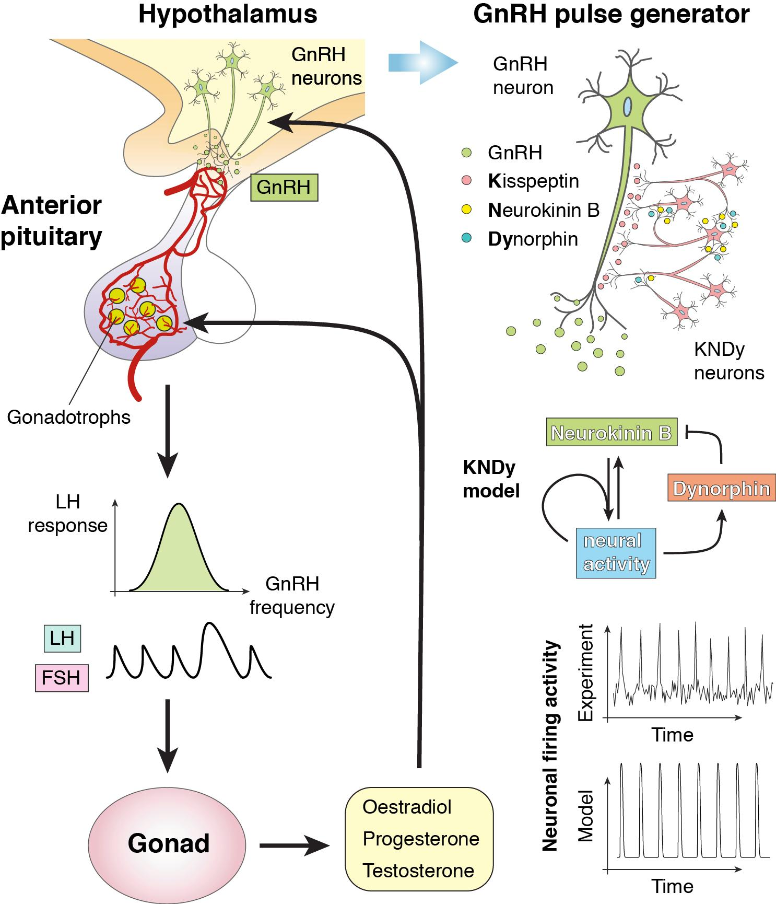

# The HPG axis
The HPG axis contains the hypothalamus, the pituitary and gonads. 

This axis is responsible for causing the testes to create testosterone. First kisspeptin neurons in the hypothalamus release kisspeptin which bind to kiss receptors on GnRH neurons which causes the release of GnRH (gondatropin releasing hormone). Kisspeptin is a big regulator of the HPG axis and a lack of it can cause issues with testosterone. In order for this to be at its peak, you want sufficient calories in the body (i.e your body can produce maintainance calories via ketogenisis if low on calories or you are in a surplus). Lepting signalling is also very important. Leptin is a hormone which is released by fat cells in the body which tells the brain how much energy it has. Lots of leptin signalling means the brain believes there is plenty of energy so more energy can be directed to producing testosterone. Normally you would think only low body fat % people would have low leptin signalling due to the lack of fat thus lack of signalling. However, obese people also have low leptin signalling because the leptin receptors become insensitive to the leptin signalling thus assuming it has no available energy. This is why it is important to be at a heavy level of body fat. This is also known as leptin resistance. 

There was also a study I read many years ago which observed the calorie expenditure of african tribes because you would assume they would be burning 10k calories a day doing all the hunting. However, it was actually found they burn very few calories (they eat very few calories) and therefore the body halts things such as reporduction, hair and nail growth etc etc.

Kisspeptin neurons are also highly influenced by your circadian rythm. It may be beneficial to go outisde during sunrise, sunset and mid day. This is because UVB light on skin and eyes can have a positive effect on te release of Kisspeptin through alpha msh which is part of the melanocortin pathway. due to  I am going to try switch my lights to candles at home to see whether it has a positive effect on my circadian rythm.

 GnRH then stimulates the pituitary gland to release LH (lutenising hormone). LH then goes from the blood to the testicles to stimulate the leydig cells which then produces testosterone. 

